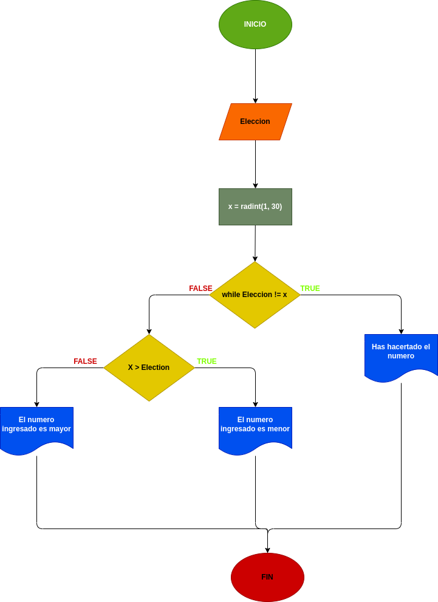

# Adivina_el_Numero
## Programa para adivinar numeros

---

# Analisis

Variables de entrada (imput)

- Eleccion : este servira para escojer un numero y ver si coinside con el que el programa hiso

Variables de proceso y salida (processing,storage, output)

- X = randint(1, 30) : Ramdomisara un numero del 1 al 30

- while Eleccion != X: Mantendra en bucle el programaasta que se logra dar con el codigo

---

# Diseño

 

